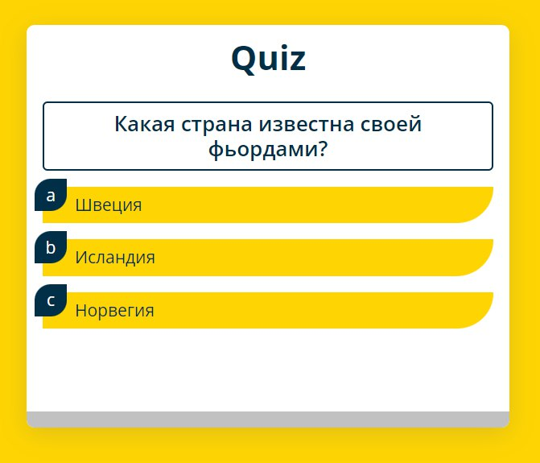

# Quiz React Application

[](https://blinklay.github.io/quiz-react/)



## Описание

**Quiz React Application** — это мини-приложение викторины, созданное с использованием React и Vite. В этом приложении случайным образом генерируются 5 вопросов из 20 возможных. Приложение включает линию прогресса для отображения текущего прогресса пользователя и возможность начать игру заново по завершению викторины.

## Стек технологий

В приложении использованы следующие технологии:

- **React**: JavaScript-библиотека для построения пользовательских интерфейсов.
- **Vite**: Быстрый сборщик и дев-сервер для современных веб-приложений.
- **ESLint**: Инструмент для статического анализа кода, обеспечивающий его соответствие установленным стандартам.

## Скриншот

Для ознакомления с внешним видом приложения, вы можете посмотреть скриншот:


## Установка и запуск

1. Клонируйте репозиторий:

   ```bash
   git clone https://github.com/blinklay/quiz-react.git
